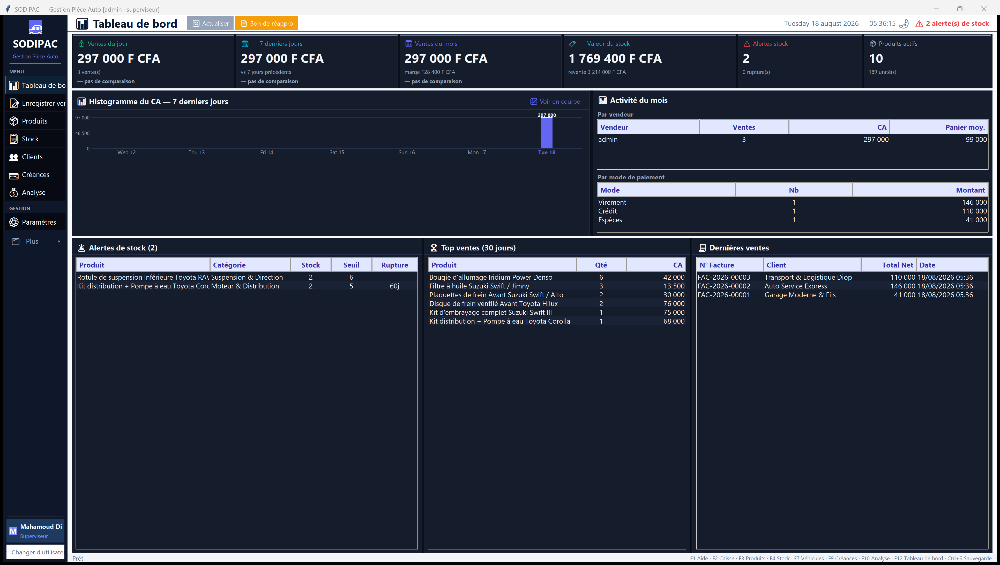
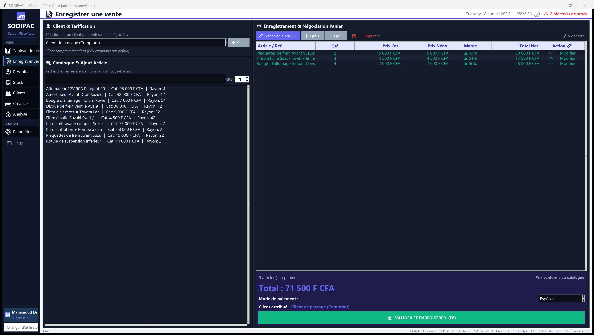
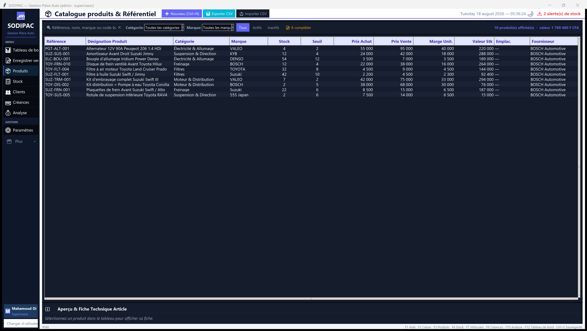

# SODIPAC — ERP & Gestion Commerciale Pièces Auto

<p align="center">
  
  
  
  
  
  
</p>

---

## 📌 Présentation

**SODIPAC** est une suite logicielle complète de **gestion commerciale (ERP / POS)** spécialement conçue pour les distributeurs et magasins de pièces de rechange automobiles. 

Développé pour un environnement de production réel avec des flux intensifs au comptoir, SODIPAC allie une interface soignée et réactive en mode sombre/clair et un moteur de données ultra-rapide (**SQLite WAL** avec transactions atomiques).

Le système est validé par **319 tests automatisés** sans framework externe (0 échec).

---

## 📸 Aperçu de l'Interface

### 📊 Tableau de bord (Mode Sombre & Mode Clair)
| Mode Sombre (Défaut) | Mode Clair |
| :---: | :---: |
|  |  |

### 🛒 Caisse & Point de Vente (POS)
| Encaissement & Panier Dynamique | Interface Caisse Claire |
| :---: | :---: |
|  |  |

### 📦 Gestion de Stock & Catalogue Produits
| Suivi des Stocks & Seuils Mini | Catalogue Produits & Alertes |
| :---: | :---: |
|  |  |

---

## 🚀 Les 18 Modules Métiers

| Module | Fonctionnalités & Logique Métier |
|---|---|
| 📊 **1. Tableau de bord** | Vue d'ensemble en temps réel : CA du jour/semaine/mois, marge nette, valeur du stock au CUMP, histogramme des ventes et alertes critiques de rupture. |
| 🛒 **2. Caisse & POS** | Vente rapide au comptoir avec négociation de prix unitaire par ligne, détection automatique du dernier prix consenti au client, indicateurs de marge en direct (vert/orange/rouge), multi-règlements (Espèces, Mobile Money, Virement, Chèque, Crédit), impression tickets et factures A4. |
| 📦 **3. Catalogue Produits** | Gestion des références constructeurs, marques, codes-barres, familles, seuils d'alerte et traçabilité des prix catalogue vs prix d'achat. |
| 🏬 **4. Gestion des Stocks** | Suivi du stock par dépôt (Vente, Réserve, Magasin), valorisation au **CUMP (Coût Unitaire Moyen Pondéré)**, seuils de sécurité et valorisation globale. |
| 👥 **5. Clients & Flottes** | Fiches clients détaillées, historique complet des achats, véhicules associés, plafonds de crédit autorisés et soldes débiteurs. |
| 🤝 **6. Créances & Encours** | Suivi des factures à crédit, échéanciers de paiement (30/60 jours), gestion des règlements partiels et état des créances douteuses. |
| 📈 **7. Rapports & Clôture** | Historique complet des ventes, clôture journalière de caisse, export Excel/CSV, analyse du CA par vendeur, par mode de règlement et par période. |
| 📥 **8. Achats & Approvisionnement** | Commandes fournisseurs, bons de livraison, réceptions partielles/totales avec recalcul automatique instantané du CUMP des articles reçus. |
| 📋 **9. Inventaire Physique** | Sessions de comptage d'inventaire, comparaison stock théorique vs réel, calcul automatique des écarts en volume et valeur, et ajustement automatique. |
| ↩️ **10. Retours & Avoirs** | Gestion des retours clients et fournisseurs, génération d'avoirs et réintégration conditionnelle des pièces dans le stock magasin. |
| 🔮 **11. Prévisions & Réappro** | Calcul prédictif des besoins de commande basé sur la vélocité des ventes et les délais de livraison pour prévenir les ruptures. |
| 🏢 **12. Multi-Dépôts** | Gestion de plusieurs magasins ou zones de stockage (Rayon Vente, Entrepôt Réserve) et transferts inter-dépôts sécurisés. |
| 🗂️ **13. Catégories & Familles** | Classification hiérarchique des pièces (Freinage, Filtration, Électricité, Distribution, Carrosserie…). |
| 🏭 **14. Fournisseurs** | Annuaire des fournisseurs, conditions commerciales, historique des approvisionnements et délais moyens. |
| 🚗 **15. Véhicules & Compatibilité** | Table de compatibilité par marque, modèle, motorisation et année pour un repérage rapide au comptoir. |
| 🔄 **16. Journal des Mouvements** | Traçabilité intégrale et inaltérable de chaque mouvement de stock (Vente, Achat, Transfert, Ajustement inventaire, Annulation). |
| 💡 **17. Analyse des Prix & Marges** | Algorithmes d'audit financier des ventes pour identifier les remises excessives, les marges dégradées et les prix sous le tarif catalogue. |
| ⚙️ **18. Paramètres & Sécurité** | Gestion des comptes et permissions (Vendeur, Gérant, Superviseur), devise (F CFA, EUR, USD…), sauvegarde automatique avec rotation 30 jours et miroir USB/Cloud. |

---

## 🏗️ Architecture & Conception

```
SODIPAC/
├── main.py                     # Point d'entrée principal de l'application
├── core.py                     # Noyau applicatif, navigation & cycle de vie
├── ui_widgets.py               # Design System, palettes (Dark / Light) & composants
├── page_*.py                   # 18 modules métiers (Caisse, Stock, Créances, etc.)
├── dialogues.py                # Modales de paiement, négociation et formulaires
├── database.py                 # Couche d'accès et requêtes SQL
├── db/
│   └── _database.py            # Moteur SQLite (23 tables, 33 index, WAL persisté)
├── metier_v3.py                # Logique métier pure (CUMP, créances, réceptions)
├── factures.py                 # Générateur HTML de factures et tickets thermiques
├── export_pdf.py               # Moteur d'exportation PDF vectoriel headless
├── tests/                      # Suite complète de 319 tests unitaires et d'intégration
├── docs/                       # Captures d'écran et documentations
└── lancer.bat                  # Lanceur standard Windows
```

### Principes d'ingénierie retenus :
- **Moteur SQLite WAL optimisé** : Connexion persistante sans réouverture coûteuse (gain de vitesse ×27), exécution atomique via `with conn:`, et `PRAGMA synchronous = OFF` assumé pour des écritures instantanées.
- **Migrations de schéma idempotentes** : Passage transparent de la v2 à la v3 sans perte de données grâce à la fonction `ajouter_colonne()` non bloquante.
- **Exactitude temporelle** : Horodatage local géré via `_maintenant()` pour éviter les décalages UTC lors de la clôture journalière des ventes.
- **Rapports PDF sans dépendance lourde** : Génération HTML/CSS vectorielle convertie en PDF natif via le moteur Edge/Chrome headless présent sur tout poste Windows.

---

## 🧪 Qualité & Tests Automatisés

Le projet applique une rigueur stricte de non-régression avec **319 assertions automatiques, 0 échec**. Aucun framework externe lourd n'est requis.

```bash
# Exécution de l'intégralité des tests unitaires et métier
python tests/run_all.py

# Exécution avec validation des interfaces graphiques
python tests/run_all.py --ui
```

### Couverture des suites de tests :

| Suite de Test | Assertions | Périmètre couvert |
|---|:---:|---|
| `test_critical.py` | 8 | Fonctions critiques : `_sync_cloud`, `_tracer_prix`, `_maj_cump` |
| `test_app.py` | 84 | Parcours applicatifs de vente, rapports, clôture caisse |
| `test_v3.py` | 141 | Logique métier v3 : multi-dépôts, calcul CUMP, créances, réceptions |
| `test_analyse_prix.py` | 86 | Algorithmes d'analyse commerciale, marges, détection d'anomalies |
| `test_ui_qt.py` | 18 | Validation du chargement et de la navigation des modules |
| **Total** | **319** | **100 % de réussite** |

- `tests/audit_calculs_total.py` : Contrôle formel de 100 % des formules financières (CUMP, marges, taxes, arrondis).
- `tests/test_mechant.py` : Tests de robustesse aux saisies invalides et injections.

---

## 💻 Installation & Démarrage

### Prérequis
- **Système** : Windows 10 ou 11 (64-bit)
- **Python** : Version 3.11 ou 3.12

### Installation & Lancement

```bash
# 1. Cloner le dépôt
git clone https://github.com/mahamoud-diabate/SODIPAC.git
cd SODIPAC

# 2. Installer les dépendances
pip install -r requirements.txt

# 3. Lancer l'application
python main.py
```

> 💡 **Sous Windows** : Double-cliquez directement sur **`lancer.bat`** (ou `lancer_logiciel.bat` en arrière-plan sans console).

### Identifiants par défaut
- **Utilisateur** : `admin`
- **Mot de passe** : `admin` *(à modifier dans Paramètres)*

---

## ⌨️ Raccourcis Clavier

| Touche | Action |
|:---:|---|
| <kbd>F1</kbd> | Aide & Documentation |
| <kbd>F2</kbd> | Enregistrer une vente (Caisse) |
| <kbd>F3</kbd> | Catalogue Produits |
| <kbd>F4</kbd> | Gestion des Stocks |
| <kbd>F5</kbd> | Répertoire Clients |
| <kbd>F8</kbd> | Valider / Encaisser la vente courante |
| <kbd>F9</kbd> | Suivi des Créances |
| <kbd>F10</kbd> | Analyse des Prix & Rentabilité |
| <kbd>F12</kbd> | Tableau de Bord Général |
| <kbd>Ctrl</kbd> + <kbd>S</kbd> | Sauvegarde manuelle immédiate de la base de données |

---

## 🔒 Confidentialité des Données

Conformément aux règles de sécurité, la base de données opérationnelle (`*.db`), les historiques de facturation réels et les sauvegardes de l'entreprise ne sont **pas** inclus dans ce dépôt public (filtrés via `.gitignore`).

---

## 📄 Licence

Ce projet est distribué sous licence [MIT](LICENSE) — © 2026 Mahamoud Diabate.

---

*Documentation technique pour développeurs disponible dans [`DEVELOPER.md`](DEVELOPER.md).*
