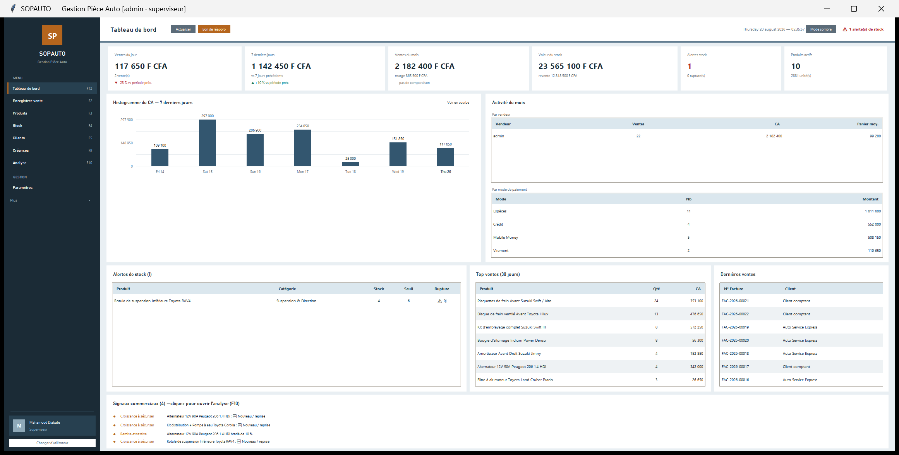
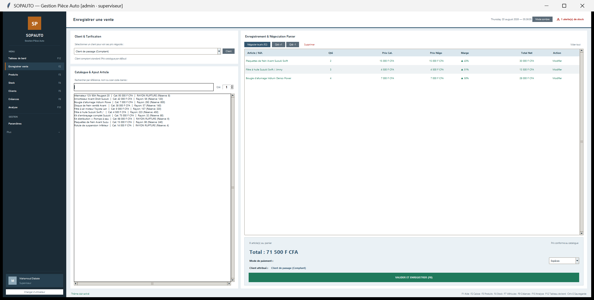
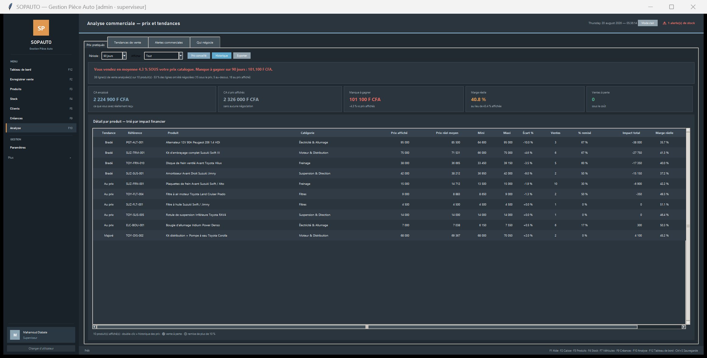
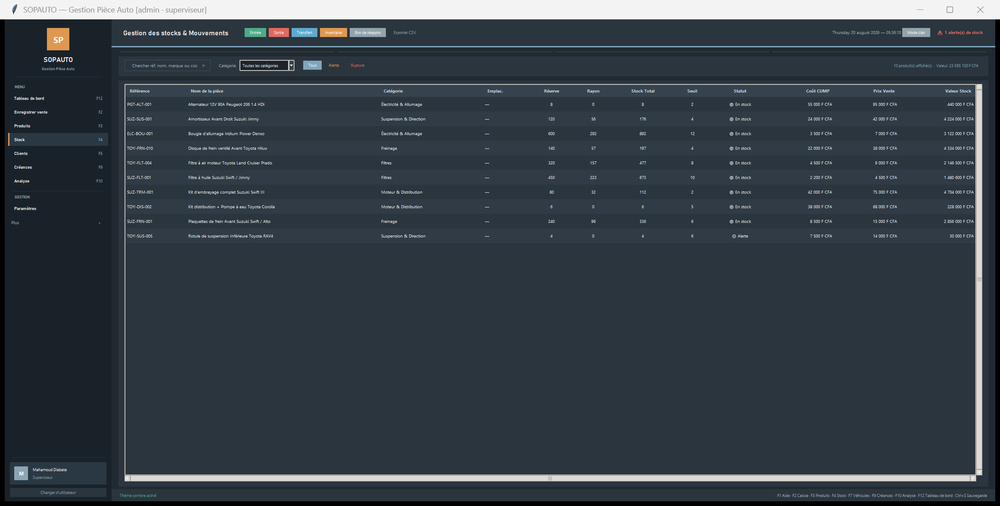
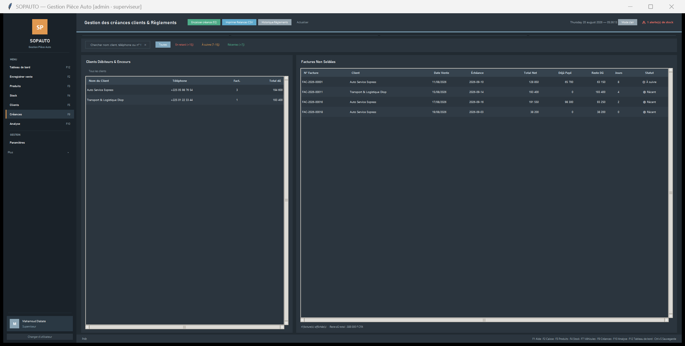

# SOPAUTO

Logiciel de gestion commerciale pour un magasin de pièces automobiles : caisse,
stock multi-dépôts, créances clients, achats, inventaire et analyse des prix.

Écrit pour une entreprise réelle, utilisé quotidiennement au comptoir depuis
2025. Python 3.11+ · Tkinter · SQLite. Aucun serveur, aucune connexion réseau
requise : l'exécutable distribué est autonome.



---

## Ce que fait le logiciel

**Caisse.** Vente au comptoir avec négociation du prix ligne par ligne. Le prix
catalogue, le prix négocié et la marge résultante sont affichés côte à côte
pendant la saisie — le vendeur voit ce qu'il concède. Multi-règlements (espèces,
mobile money, virement, chèque, crédit), ticket et facture A4.

**Stock multi-dépôts.** Réserve et rayon suivis séparément, valorisation au coût
unitaire moyen pondéré (CUMP) recalculé à chaque réception. Le prix d'achat est
figé sur la ligne de vente au moment de la transaction, ce qui rend la marge
historique exacte même après un changement de tarif fournisseur.

**Créances.** Plafond de crédit par client contrôlé au moment de la vente,
échéances, règlements partiels, relances exportables.

**Analyse des prix.** Compare le prix réellement encaissé au prix catalogue sur
la période, produit par produit : écart moyen, amplitude de négociation, manque
à gagner chiffré, détection des ventes sous le coût d'achat.

Le reste : achats et réceptions, inventaire physique avec écarts valorisés,
retours et avoirs, transferts entre dépôts, prévisions de rupture, compatibilité
véhicules, journal des mouvements, rapports et clôture de caisse.

---

## Aperçu

| Caisse | Analyse des prix |
| :---: | :---: |
|  |  |

| Stock | Créances |
| :---: | :---: |
|  |  |

Captures produites par `python generate_screenshots.py`, sur une base de
démonstration jetable. Jamais sur les données du magasin.

---

## Installation

```bash
git clone https://github.com/mahamoud-diabate/SOPAUTO.git
cd SOPAUTO
pip install -r requirements.txt
python main.py
```

Windows 10 ou 11, Python 3.11 ou 3.12. Sous Windows, `lancer.bat` suffit.

Première connexion : `admin` / `admin123`, à changer dans Paramètres.

---

## Architecture

```
main.py              point d'entrée
core.py              navigation, thème, permissions
page_*.py            18 écrans, un fichier par écran
dialogues/           21 dialogues modaux
db/_database.py      23 tables, 33 index, migrations additives
metier/              CUMP, créances, réceptions
analyse_prix.py      analyse des prix pratiqués
factures.py          HTML → PDF via le navigateur du poste
ui_widgets.py        palettes, widgets partagés
tests/               suite de tests, sans framework externe
```

`Application` hérite de 18 mixins, un par écran. Chaque écran ne connaît que son
domaine ; le noyau ne connaît que la navigation.

**SQLite en mode WAL, connexion persistante.** Lecteurs et écrivain ne se
bloquent pas. La connexion reste ouverte pour la durée de la session plutôt
qu'ouverte et refermée à chaque requête.

**Migrations additives et idempotentes.** `_ajouter_colonne()` n'ajoute une
colonne que si elle manque : une base v2 devient v3 sans perte ni script manuel.

**Horodatage local.** `CURRENT_TIMESTAMP` est en UTC ; `_maintenant()` fournit
l'heure locale, sans quoi les ventes du soir tombaient sur le lendemain.

Les règles d'interface — palette, typographie, iconographie, états d'écran — sont
consignées dans [DESIGN.md](DESIGN.md).

---

## Tests

319 tests, aucune dépendance externe : chaque fichier est un script autonome.

```bash
python tests/run_all.py          # 319 tests
python tests/run_all.py --ui     # 323, en incluant les suites d'interface
```

| Suite | Tests | Couvre |
| --- | ---: | --- |
| `test_critical.py` | 8 | synchronisation cloud, traçage des prix, calcul du CUMP |
| `test_app.py` | 84 | parcours de vente, rapports, clôture |
| `test_v3.py` | 141 | dépôts, créances, achats, transferts |
| `test_analyse_prix.py` | 86 | marges, écarts de prix, divisions par zéro |

Quatre suites d'interface (`test_ui*.py`) ouvrent de vraies fenêtres et sont
exclues par défaut. `tests/audit_calculs_total.py` revérifie toutes les formules
financières ; `test_mechant.py` et `test_stress_debutant.py` couvrent les saisies
aberrantes.

---

## Raccourcis

`F2` caisse · `F3` produits · `F4` stock · `F5` clients · `F9` créances
`F10` analyse · `F12` tableau de bord · `F8` valider la vente · `Ctrl+S` sauvegarde

---

## Données

La base, les factures et les sauvegardes contiennent les données réelles de
l'entreprise et ne sont pas dans ce dépôt (voir `.gitignore`). Sauvegarde
automatique avec rotation sur 30 copies, plus un miroir externe optionnel avec
checkpoint WAL forcé avant copie.

---

[MIT](LICENSE) — © 2026 Mahamoud Diabate. Notes techniques : [DEVELOPER.md](DEVELOPER.md).
