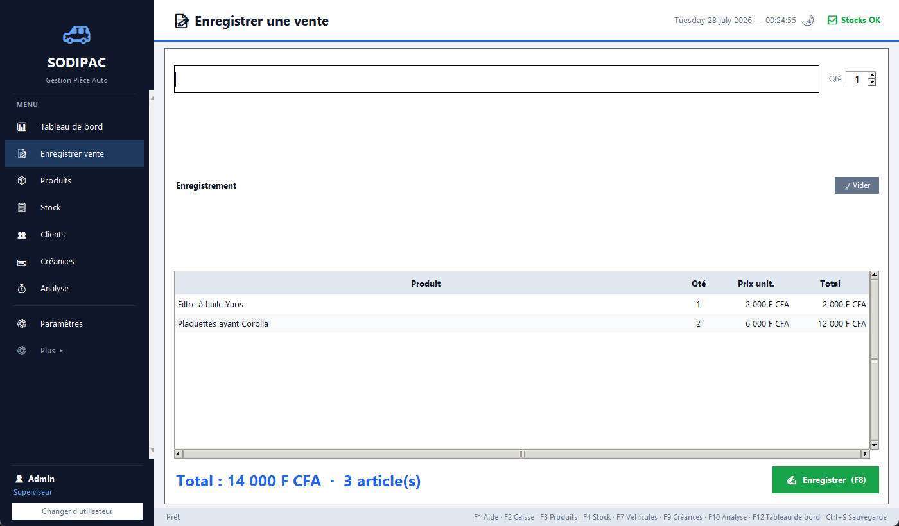

# SODIPAC — Gestion Pièce Auto

Logiciel de **gestion commerciale (POS)** pour magasin de pièces automobiles : caisse, stock multi-dépôts, créances, achats, inventaire et analyse commerciale. Conçu pour une entreprise réelle et validé par **319 tests automatisés**.



**Python 3.11+ · Tkinter · SQLite (WAL) · PyInstaller** — zéro dépendance externe pour l'utilisateur final.

---

## Fonctionnalités

| Module | Description |
|---|---|
| 🛒 **Caisse (POS)** | Ventes avec négociation de prix par ligne, remise globale, crédit, multi-modes de paiement, ticket/facture PDF |
| 📦 **Stock multi-dépôts** | Valorisation au **CUMP** (coût unitaire moyen pondéré), snapshot `prix_achat` figé pour la marge réelle, alertes de rupture, prévisions |
| 🤝 **Créances clients** | Plafonds de crédit, échéances, paiements partiels, historique |
| 📥 **Achats & inventaire** | Commandes fournisseur, réceptions, inventaire physique, transferts entre dépôts, retours/avoirs |
| 📊 **Analyse** | Tableau de bord, rentabilité, analyse des prix pratiqués (remises/majorations vs catalogue), prix conseillé |
| 🔐 **Multi-utilisateurs** | 3 rôles (Vendeur / Gérant / Superviseur), mots de passe hachés (PBKDF2) |
| 💾 **Sauvegardes** | Automatiques (rotation 30) + miroir externe USB/Cloud avec checkpoint WAL forcé |

## Architecture

```
main.py                  Point d'entrée
core.py                  Application — hérite de 18 mixins (1 par écran)
db/_database.py          23 tables, 33 index, migrations additives idempotentes
metier_v3.py             Logique métier (CUMP, créances, achats…)
dialogues/               20 classes de dialogues
factures.py + export_pdf.py   HTML → PDF via navigateur headless (Edge/Chrome)
analyse_prix.py          Analyse des prix pratiqués
schema_v3.py             Migration additive du schéma v3
```

- **Pattern mixins** : chaque écran est une classe avec uniquement les méthodes de son domaine ; `Application` les compose tous.
- **SQLite WAL** : lecteurs et écrivain non bloquants, connexion persistante (×27 plus rapide), `PRAGMA synchronous = OFF` assumé pour la vitesse.
- **Migrations sûres** : `_ajouter_colonne()` idempotente — les bases v2 passent à v3 sans perte de données.
- **Horodatage local** : `CURRENT_TIMESTAMP` (UTC) corrigé par `_maintenant()` pour que les ventes du soir comptent le bon jour.

## Qualité

- **319 tests automatisés** (pytest) : `test_critical.py`, `test_ui.py`, `test_analyse_prix.py`…
- `audit_calculs_total.py` : vérifie **100 % des formules** (marges, CUMP, taxes, remises, agrégations).
- Testé en **conditions réelles** dans l'entreprise depuis 2025.

## Lancement

```bash
python main.py            # ou double-clic sur lancer.bat
```

Connexion par défaut : `admin` / `admin` (à changer en production).

> ⚠️ **Confidentialité** : la base de données, les factures et les sauvegardes (données réelles de l'entreprise) ne sont **pas** incluses dans ce dépôt (voir `.gitignore`).

## Raccourcis

`F2` Caisse · `F3` Produits · `F4` Stock · `F5` Clients · `F9` Créances · `F10` Analyse · `F12` Tableau de bord · `Ctrl+S` Sauvegarde

---

*SODIPAC v3 — 2026 · Documentation développeur : [`DEVELOPER.md`](DEVELOPER.md)*
